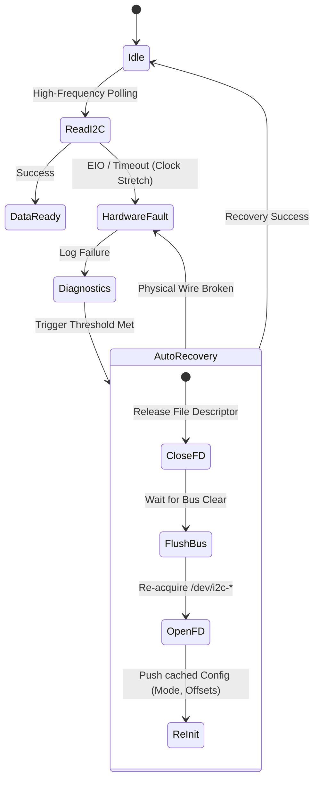
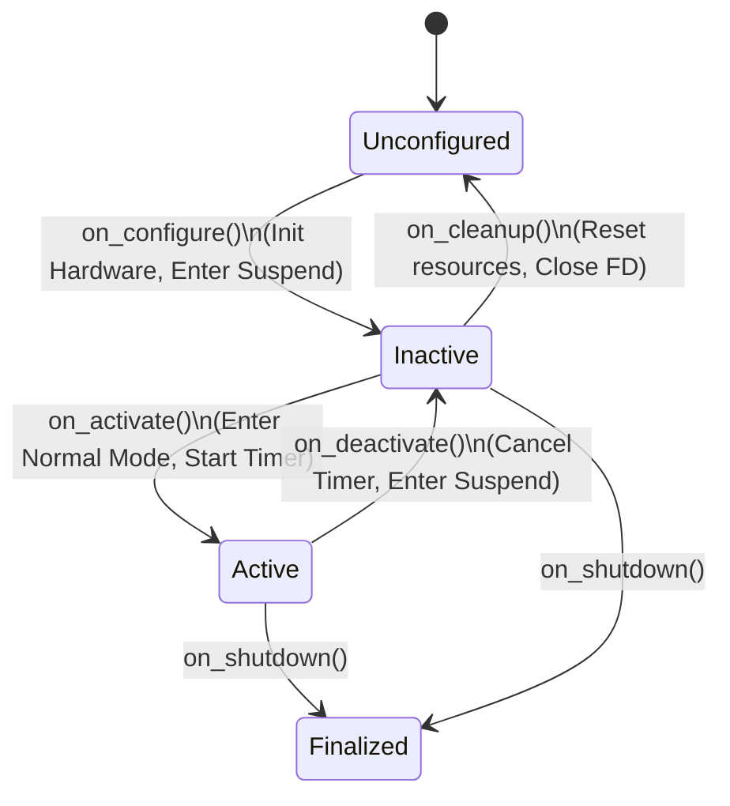

# Architecture and Design Decisions

The `libbno055-linux` library provides a C++ interface to the BNO055 sensor over I2C on Linux. It is designed for robotics and control loops, emphasizing deterministic execution and error recovery. 

This document outlines the core technical philosophies, low-level trade-offs, and architectural decisions that guarantee its reliability.

---

## 1. Zero-Allocation & Exception-Free Hot Paths

In hard real-time systems, non-deterministic latency spikes caused by heap memory fragmentation or C++ exception unwinding are strictly forbidden.

### Stack-Allocated I2C Buffers
Standard C++ libraries often rely on `std::vector` or `std::string` for dynamic byte buffers. `libbno055-linux` strictly utilizes fixed-size stack arrays (e.g., `uint8_t buffer[32]`) for all I2C `read()` and `write()` operations. 
* **Benefit**: Zero heap allocation (`malloc`/`new`) during the sensor polling loop. This ensures perfect cache locality and strictly bounded $O(1)$ execution time.

### The `noexcept` API Surface
Instead of throwing `std::runtime_error` when an I2C cable is temporarily disconnected, the library provides a parallel `noexcept` API returning `std::optional<T>`.
```cpp
// ❌ Traditional blocking/throwing API (Unsafe for RTOS)
bno055lib::Quaternion q = imu.getQuaternion(); // Might throw bno055lib::IMUError!

// ✅ Deterministic, real-time safe API
if (auto q = imu.getQuaternionNoexcept()) {
    control_loop.update(*q);
} else {
    control_loop.coast(); // Handle hardware drop gracefully
}
```

---

## 2. The PIMPL Idiom (Pointer to Implementation)

To guarantee **Application Binary Interface (ABI) stability** across different ROS 2 distributions (Foxy to Jazzy) and compiler versions, the library extensively utilizes the PIMPL (Compiler Firewall) idiom.

### Encapsulation
If you inspect `include/libbno055-linux/bno055.hpp`, you will not find any Linux-specific headers (`<linux/i2c-dev.h>`, `<sys/ioctl.h>`) or threading primitives (`<mutex>`). 
* All internal file descriptors, mutexes, and mock states are hidden behind a forward-declared `Impl` pointer.
* **Benefit**: Including this library in your colossal ROS 2 project will not pollute your global namespace with Linux POSIX macros, and it dramatically reduces compilation time.

---

## 3. I2C Clock Stretching & The Auto-Recovery Engine

### The Hardware Flaw
The Bosch BNO055 has a known hardware quirk: it heavily utilizes **I2C clock stretching** while its internal Cortex-M0 processor computes sensor fusion math. Many Linux single-board computers (specifically the Broadcom SoC on the Raspberry Pi) possess a silicon bug that fails to handle prolonged clock stretching, causing the I2C bus to physically lock up and return `EIO` (Input/Output Error) to the kernel driver.

### The Self-Healing State Machine
To combat this, `libbno055-linux` implements a robust self-healing state machine. When the kernel reports an I2C timeout or physical disconnect, the library does not crash.



When `AutoRecovery` triggers, the library transparently resets the file descriptor and pushes your previously configured `OpMode` and calibration offsets back into the sensor registers without requiring application-level intervention.

---

## 4. Thread Safety & Concurrency

A single `BNO055` instance is often accessed by multiple threads in a modern robotics stack:
1. **Control Thread (100Hz)**: Reading `getQuaternionNoexcept()`.
2. **Telemetry Thread (1Hz)**: Reading `getDiagnostics()` to monitor I2C health.
3. **Service Callbacks**: Saving calibration profiles on demand.

The internal `Impl` struct is protected by a lightweight `std::mutex`, ensuring that multi-byte I2C register reads (which require sequential `write` (register address) followed by `read` (data)) are strictly atomic and cannot be interleaved by the Linux scheduler.

---

## 5. Cross-Platform Mocking (CI/CD Ready)

Modern C++ development relies heavily on Continuous Integration (GitHub Actions, GitLab CI). If a library strictly requires `<linux/i2c-dev.h>`, it cannot be compiled on macOS or Windows, breaking the CI pipeline for developers working on MacBooks.

`libbno055-linux` detects the host OS at compile time via CMake. If compiled on a non-Linux platform, it automatically swaps the internal `Impl` to a **Mocked I2C Interface**.
* **Result**: You can compile your ROS 2 packages natively on macOS/Windows, write GTest unit tests against the IMU logic, and verify your math without needing a physical Raspberry Pi or sensor.

---

## 6. ROS 2 Node Architectures & Zero-Copy Communication

The library includes two ROS 2 node implementations located in the `src/ros2/` directory, designed to cover various robotics system requirements:

### Standard Standalone Node (`bno055_publisher_node`)
Optimized for resource-constrained embedded systems and high-rate feedback loops. It initializes the sensor, redirects logs to `RCLCPP`, and publishes IMU messages via a standard asynchronous timer.
* **Zero-Copy Message Passing**: This node allocates messages via `std::make_unique` and passes ownership using `std::move()`, with intra-process communication enabled by default. When executed within a ROS 2 Composable Node Container, ROS 2 completely bypasses message serialization and memory copying, passing the underlying pointer directly through shared memory.
* **Deterministic Execution**: Uses `noexcept` APIs to ensure that sensor read failures do not invoke the overhead of C++ stack unwinding in high-frequency control loops.


### Managed Lifecycle Node (`bno055_lifecycle_publisher_node`)
For robots requiring strict startup sequences and energy efficiency, the Lifecycle Node maps ROS 2 state transitions directly to BNO055 hardware states:



* **Power Efficiency (Suspend Mode)**: In the `Inactive` state (before activation or after deactivation), the node puts the BNO055 sensor into low-power **Suspend Mode** and pauses the high-rate publishing timer. The sensor only wakes up to **Normal Mode** when transitioned to the `Active` state.
* **Deterministic Initialization**: Avoids racing conditions in robot startup by letting the coordinator configure and test I2C connectivity before active streaming starts.
